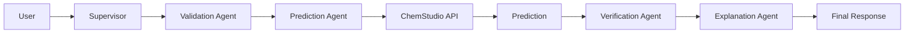

# ChemStudio Agent API Integration Guide

> Version: V1.0
>
> Purpose:
> This document defines how AI agents should communicate with the ChemStudio
> Reaction Prediction API. It acts as the contract between the backend model
> service and the agent orchestration layer.

---

# Table of Contents

1. Overview
2. API Endpoint
3. Request Schema
4. Response Schema
5. Error Handling
6. Agent Workflow
7. Validation Rules
8. Integration Strategy
9. Future Compatibility
10. Best Practices

---

# 1. Overview

The Reaction Prediction API is a lightweight inference service responsible for
predicting reaction products using a fine-tuned FLAN-T5 model.

The API **only performs prediction**.

It does **NOT**

- validate chemistry
- explain mechanisms
- retrieve literature
- verify confidence
- perform reasoning

Those responsibilities belong to higher-level agents.

---

# 2. API Endpoint

## Base URL

```
https://YOUR_MODAL_ENDPOINT.modal.run
```

---

## Prediction Endpoint

```
POST /predict
```

---

# 3. Request Schema

Current API accepts

```json
{
    "reactants": "CCO.CCBr",
    "mechanism": "SN2"
}
```

---

## Field Definitions

### reactants

Type

```
string
```

Required

```
Yes
```

Description

Reaction SMILES representing reactants.

Example

```
CCO.CCBr
```

---

### mechanism

Type

```
string
```

Required

```
Yes
```

Examples

```
SN1
SN2
Oxidation
Reduction
E1
E2
```

---

Current Supported Payload

```json
{
    "reactants":"CCO.CCBr",
    "mechanism":"SN2"
}
```

---

# 4. Response Schema

Successful response

```json
{
    "success": true,
    "prediction": "CCOC1CCCN1"
}
```

---

Field Description

success

```
bool
```

Indicates successful inference.

---

prediction

```
string
```

Predicted product SMILES.

---

# 5. Error Responses

Example

```json
{
    "success": false,
    "error": "Invalid request"
}
```

Possible causes

- Missing reactants
- Missing mechanism
- Invalid JSON
- Internal model error

---

# 6. Agent Workflow



The Prediction Agent is the **only component** that communicates with the API.

---

# 7. Responsibilities

## Prediction Agent

Responsible for

- preparing payload
- calling API
- parsing response
- retrying failures

Not responsible for

- chemistry validation
- explanation
- literature retrieval

---

## Validation Agent

Responsible for

- SMILES validation
- canonicalization
- syntax checking
- missing information detection

---

## Verification Agent

Responsible for

- confidence estimation
- RDKit verification
- chemical sanity checks

---

## Explanation Agent

Responsible for

- reaction mechanism explanation
- educational output
- reasoning generation

---

# 8. Suggested Agent State

```python
ReactionState

reactants: str

mechanism: str

prediction: str

confidence: float

validated: bool

verification_passed: bool

explanation: str

error: str
```

---

# 9. Prediction Node

Input

```python
ReactionState
```

↓

Create payload

```python
{
    "reactants": state.reactants,
    "mechanism": state.mechanism
}
```

↓

POST

```
/predict
```

↓

Receive

```python
prediction
```

↓

Update

```python
state.prediction
```

---

# 10. Retry Strategy

Retry only on

- timeout
- HTTP 500
- connection errors

Do NOT retry

- invalid payload
- validation failure
- malformed SMILES

Recommended

```
Maximum retries = 3
```

Exponential backoff

```
1 sec

2 sec

4 sec
```

---

# 11. Validation Before API Call

The API assumes valid inputs.

Agent should verify

✓ reactants exist

✓ mechanism exists

✓ valid SMILES

✓ canonical SMILES (recommended)

Only then call

```
POST /predict
```

---

# 12. Future Payload Compatibility

The API is expected to evolve.

Future payload

```json
{
    "reactants": "...",
    "mechanism": "SN2",
    "temperature": 80,
    "pressure": 1,
    "solvent": "DMF",
    "catalyst": "...",
    "time": "2h",
    "reagents": [],
    "metadata": {}
}
```

Agent should avoid hardcoding only two fields.

Instead, construct payload dynamically.

Example

```python
payload = {
    "reactants": state.reactants,
    "mechanism": state.mechanism,
}

if state.temperature is not None:
    payload["temperature"] = state.temperature

if state.solvent:
    payload["solvent"] = state.solvent
```

This keeps the Prediction Agent forward-compatible.

---

# 13. Suggested Folder Structure

```
agents/

    supervisor.py

    validator.py

    predictor.py

    verifier.py

    explainer.py

services/

    chemstudio_client.py

schemas/

    reaction_state.py
```

The Prediction Agent should never perform HTTP requests directly.

Instead

```
Prediction Agent

↓

ChemStudioClient

↓

HTTP

↓

API
```

This separates business logic from networking.

---

# 14. Client Interface

Suggested interface

```python
predict(
    reactants: str,
    mechanism: str
) -> PredictionResponse
```

Future interface

```python
predict(
    reactants,
    mechanism,
    temperature=None,
    solvent=None,
    catalyst=None,
    pressure=None,
    time=None
)
```

---

# 15. End-to-End Flow

```mermaid
flowchart TD

User

-->

Supervisor

-->

Validator

-->

Canonicalize

-->

Prediction Agent

-->

ChemStudio API

-->

Predicted Product

-->

Verifier

-->

Explainer

-->

Final Report
```

---

# Integration Notes

The ChemStudio Prediction API is intentionally designed as a stateless inference service.

Key principles:

- The API only predicts reaction products.
- Input validation is handled by the Validation Agent.
- Chemical verification is handled by the Verification Agent.
- Mechanistic reasoning is handled by the Explanation Agent.
- HTTP communication should be isolated in a dedicated client layer.
- Payload construction should be dynamic to support future reaction conditions such as temperature, solvent, catalyst, pressure, and reaction time without requiring changes to the agent architecture.

Following these principles keeps the prediction service lightweight while allowing the multi-agent system to evolve independently.