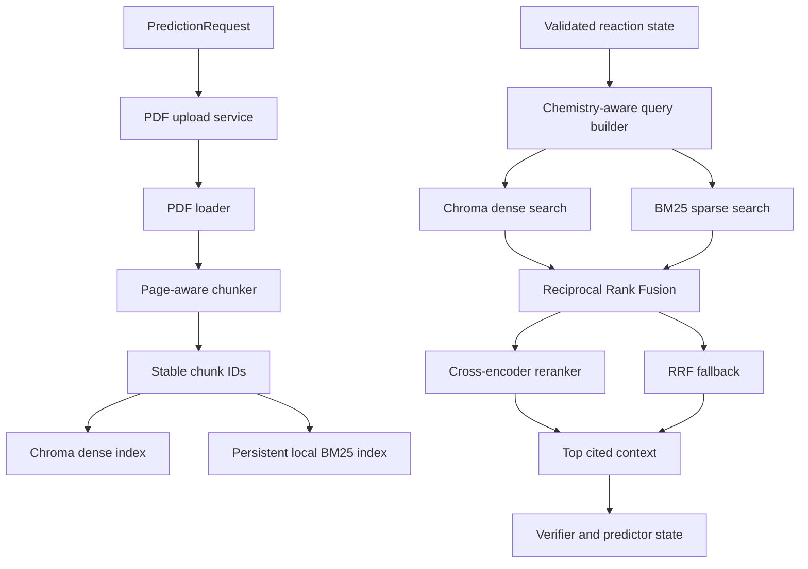

# Chem Process Studio Retrieval Architecture V2

> Status: implemented retrieval architecture integrated with the prediction workflow.
> This document describes the behavior currently present in the repository, not a
> future design proposal.

## 1. Purpose

Retrieval V2 supplies chemistry literature evidence to the reaction prediction,
verification, and explanation agents. It is designed for uploaded PDF documents
and keeps the evidence traceable to its source document, page, and chunk.

The architecture addresses the main weaknesses of a dense-only RAG pipeline:

- exact chemistry tokens can be missed by semantic search;
- vector and keyword scores are not directly comparable;
- repeated ingestion can create duplicate chunks;
- retrieved text without citations is difficult to audit;
- a large candidate set can reduce answer quality and increase model cost;
- a temporary reranker failure should not make retrieval completely unavailable.

## 2. Architecture at a glance



The retrieval path has two phases:

1. **Ingestion** prepares and indexes uploaded documents.
2. **Query-time retrieval** searches both indexes, fuses rankings, reranks the
   candidates, and writes cited evidence into the shared workflow state.

## 3. End-to-end request flow

### 3.1 API entry point

`POST /predict` accepts:

```json
{
  "reactants": "CCO.CCBr",
  "mechanism": "SN2",
  "conditions": {
    "solvent": "DMF",
    "temperature": "room temperature"
  },
  "pdf_context": ["D:/literature/reaction-study.pdf"]
}
```

The route creates a `ReactionState`. When `pdf_context` is non-empty, ingestion
runs before the supervisor workflow. Each PDF gets an ingestion result and a
checksum-based document ID.

### 3.2 Supervisor workflow

For a prediction intent, the current sequence is:

```text
validator -> retriever -> pre_review -> predictor -> verifier -> explainer
```

The validator canonicalizes the reaction input before the retriever builds its
query. Retrieval therefore receives the best available form of the molecule:
`canonical_smiles`, then the original `smiles`, then `Not provided`.

When no PDF is successfully ingested, the retriever returns an empty context and
marks external document availability as false. The rest of the workflow can
continue without fabricated literature evidence.

## 4. Ingestion pipeline

### 4.1 PDF loading and identity

`pdf_loader`:

- resolves and verifies the input path;
- accepts only `.pdf` files;
- extracts pages with `PyPDFLoader`;
- computes a SHA-256 checksum over the file bytes;
- attaches `document_id`, `document_checksum`, `pdf_name`, `page`, and
  `total_pages` metadata to every page.

The checksum serves as the stable identity for a document and allows query-time
retrieval to be restricted to the PDFs uploaded for the current request.

### 4.2 Page-aware chunking

`text_splitter` first treats each non-empty PDF page as a section, then applies a
recursive character splitter:

| Setting | Current value |
| --- | ---: |
| Chunk size | 1,200 characters |
| Chunk overlap | 150 characters |
| Separators | paragraph, line, sentence, semicolon, comma, word |
| Chunking version | `page-aware-v1` |

Every chunk retains source and page metadata and adds a global chunk index, an
in-page chunk index, and its character count. Keeping page boundaries visible
makes citations more useful than a flat text corpus.

### 4.3 Stable IDs and duplicate protection

`build_chunk_id` hashes:

```text
source | page | normalized content | chunk index
```

The same ID is used by Chroma and BM25. Before indexing, Chroma checks existing
IDs and BM25 checks its JSON records. Re-ingesting an unchanged document skips
already indexed chunks instead of creating duplicate records. Successful
ingestion clears the in-process hybrid query cache.

### 4.4 Two indexes

**Chroma dense index**

- Uses lightweight CPU-based `FastEmbedEmbeddings`.
- Default model: `BAAI/bge-small-en-v1.5` (free and runs locally).
- Persists to `database/chroma`.
- Stores scalar metadata suitable for Chroma filtering.
- Returns semantic candidates with vector distance values.

**Local BM25 sparse index**

- Uses `rank_bm25`.
- Persists source records to `database/bm25_index.json`.
- Uses a chemistry-friendly tokenizer that preserves terms such as `SN2`,
  `NaBH4`, `Pd/C`, `DMF`, and `Cu(I)` more effectively than word-only splitting.
- Supports equality and `$in` metadata filters.
- Rebuilds its in-memory scorer at startup and after new documents are added.

The indexes are intentionally independent: dense retrieval provides semantic
similarity, while BM25 provides lexical precision for reagents, mechanisms,
solvents, abbreviations, and exact reported terms.

## 5. Query-time retrieval

### 5.1 Chemistry-aware query construction

The retriever creates one shared query for both engines containing:

- canonical or original reactant SMILES;
- requested or predicted mechanism;
- sorted reaction conditions;
- an evidence-oriented instruction covering experimental evidence, comparable
  reactions, compatible conditions, mechanisms, and reported products.

Using the same query for dense and sparse search makes the two rankings
comparable at the candidate level and avoids divergent retrieval intent.

### 5.2 Document scoping

If ingestion succeeded, the retriever builds a Chroma-compatible filter using the
successful `document_ids`:

```python
{"document_id": {"$in": document_ids}}
```

The same filter semantics are applied by BM25. This prevents a request from
silently retrieving unrelated documents already present in the local indexes.

### 5.3 Candidate generation

The current defaults are:

| Stage | Count |
| --- | ---: |
| Dense candidates | 40 |
| Sparse candidates | 40 |
| RRF candidates | 30 |
| Final context | 8 |
| RRF constant | 60 |

Dense and sparse results are represented with the same `chunk_id`, content, and
metadata fields. This shared identity is what allows a chunk returned by both
engines to receive credit from both rankings.

### 5.4 Reciprocal Rank Fusion

RRF combines positions rather than raw scores:

$$
\operatorname{RRF}(d) = \sum_{r \in R(d)} \frac{1}{60 + r}
$$

where $R(d)$ contains the rank of chunk $d$ in each retrieval result set.

This is important because Chroma distances and BM25 scores have different
scales and meanings. A chunk that ranks well in both engines naturally moves up,
while a strong result from only one engine remains eligible.

The implementation returns the fused candidates ordered by `rrf_score` and
preserves dense rank, BM25 rank, dense distance, and BM25 score for diagnostics.

### 5.5 Cross-encoder reranking

The top 30 RRF candidates are scored as complete `(query, chunk)` pairs by a
lazy-loaded `sentence-transformers` `CrossEncoder`.

- Default model: `cross-encoder/ms-marco-MiniLM-L-6-v2`.
- Final output: up to 8 candidates.
- The reranker score and reranker rank are retained in the result.
- Model loading is deferred until the first retrieval that needs it.

This second-stage model can inspect the query and passage together, which is
more precise than comparing independently computed embeddings. It is applied to
a small candidate set to control latency and memory usage.

### 5.6 Graceful fallback

If the cross-encoder cannot load or score, the retriever returns the first eight
RRF candidates and adds a warning to the workflow state. Retrieval therefore
degrades from reranked hybrid search to fused hybrid search instead of failing
the entire prediction request.

## 6. Retrieval state contract

The retriever writes the following fields into `ReactionState`:

```json
{
  "external_doc_available": true,
  "retrieved_context": [
    {
      "chunk_id": "sha256...",
      "content": "...",
      "source": "reaction-study.pdf",
      "page": 4,
      "section": null,
      "metadata": {
        "document_id": "sha256...",
        "chunking_version": "page-aware-v1"
      },
      "retrieval": {
        "rrf_rank": 1,
        "rrf_score": 0.0315,
        "dense_rank": 2,
        "bm25_rank": 5,
        "reranker_rank": 1,
        "reranker_score": 3.2
      }
    }
  ]
}
```

This contract improves observability: downstream agents receive evidence and
its provenance, while operators can inspect which retriever and rank produced
each chunk.

## 7. Improvements delivered in V2

### Retrieval quality

- **Hybrid dense plus sparse search:** combines semantic similarity with exact
  chemistry vocabulary matching.
- **Rank-based fusion:** avoids invalid arithmetic between incompatible dense and
  BM25 score scales.
- **Cross-encoder reranking:** improves final ordering by reading each query and
  chunk pair jointly.
- **Chemistry-aware query context:** includes structure, mechanism, and
  conditions rather than searching only the raw SMILES.
- **Page-aware chunking:** preserves experimentally meaningful page boundaries.

### Correctness and isolation

- **Stable checksum document identity:** identifies the actual PDF bytes.
- **Stable chunk identity:** makes Chroma and BM25 refer to the same evidence.
- **Duplicate ingestion protection:** unchanged chunks are skipped in both stores.
- **Per-request document filtering:** retrieval is scoped to successfully uploaded
  documents.
- **Explicit empty-context behavior:** absence of documents is represented rather
  than masked by unrelated corpus results.

### Reliability and operations

- **Bounded LRU-style query cache:** stores up to 128 hybrid result sets and is
  invalidated after ingestion.
- **Lazy reranker loading:** startup does not require loading the cross-encoder.
- **RRF fallback:** a reranker outage preserves useful retrieval.
- **Ingestion diagnostics:** each PDF reports success, errors, page count, chunk
  count, and Chroma/BM25 indexing counts.
- **Rank and score telemetry:** evidence retains the information needed to debug
  retrieval decisions.

### Evaluation readiness

`tools/retrieval/evaluation.py` provides offline metrics and helpers for:

- context relevance;
- recall at $k$;
- reciprocal rank;
- groundedness of answer claims;
- answer relevance through an injected LLM judge.

These helpers establish a path for comparing dense-only, hybrid, and reranked
variants on a labeled chemistry retrieval set.

## 8. Failure behavior and boundaries

| Condition | Current behavior |
| --- | --- |
| Missing PDF list | Empty context; workflow continues |
| Invalid or unreadable PDF | Per-file failure recorded as a warning |
| No searchable chunks | That file fails ingestion |
| No matching chunks | Empty context and warning |
| Reranker unavailable | Return top RRF candidates and warning |
| Corrupt BM25 JSON | Start with an empty BM25 index; future ingestion can rebuild it |
| Empty query | Return no hybrid candidates |

The retriever does not claim that a retrieved passage proves a prediction. The
verifier remains responsible for checking product validity, mechanism alignment,
and context alignment before the result is presented.

## 9. Current limitations and next engineering steps

- BM25 is a local JSON-backed index and is not yet suitable for multi-process or
  multi-user production deployment.
- The embedding and reranker models are downloaded/loaded locally; model
  pinning, warmup, and resource monitoring are still needed for deployment.
- PDF extraction is text-based and does not yet robustly handle scanned pages,
  figures, chemical structures, or complex tables.
- Chunk size, overlap, candidate counts, and thresholds are configuration
  constants rather than values tuned against a labeled benchmark.
- Evaluation helpers exist, but no committed benchmark dataset or regression
  results are present yet.
- The API currently accepts filesystem paths in `pdf_context`; an upload endpoint,
  authentication, tenant isolation, and durable document lifecycle are still
  needed.
- Legacy dense-only compatibility functions remain in `RAG_tool.py` for callers
  that have not migrated to `hybrid_retrieve_context`.
- The broader workflow still depends on the predictor model integration and
  runtime validation of all agent and middleware branches.

## 10. Configuration reference

| Environment variable | Default | Purpose |
| --- | --- | --- |
| `Embedding_MODEL` | `BAAI/bge-small-en-v1.5` | Chroma embedding model |
| `CHROMA_COLLECTION_NAME` | `chemistry_literature_bge_small` | Chroma collection |
| `CHROMA_PERSIST_DIRECTORY` | `database/chroma` | Chroma persistence path |
| `BM25_INDEX_PATH` | `database/bm25_index.json` | BM25 JSON index path |
| `RERANKER_MODEL` | `cross-encoder/ms-marco-MiniLM-L-6-v2` | Cross-encoder model |

## 11. Source map

| Responsibility | Implementation |
| --- | --- |
| Retrieval agent and query | `agents/retriever.py` |
| Ingestion and hybrid orchestration | `tools/retrieval/RAG_tool.py` |
| PDF identity and page metadata | `tools/retrieval/pdf_loader.py` |
| Page-aware chunking | `tools/retrieval/text_splitter.py` |
| Dense index | `tools/retrieval/chroma_tool.py` |
| Sparse index | `tools/retrieval/bm25_tool.py` |
| Reranking | `tools/retrieval/reranker.py` |
| Offline metrics | `tools/retrieval/evaluation.py` |
| API ingestion integration | `services/pdf_inestion_services.py` and `api/routes.py` |
| Shared state contract | `utils/schema.py` and `graph/state.py` |
