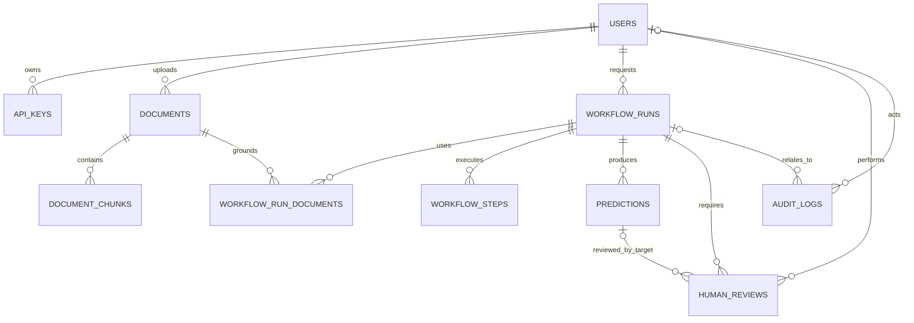

# Chem Process Studio — Revised Database Design

## Scope and design decisions

**Source-derived:** PostgreSQL is the system of record; Chroma stores vector embeddings; Redis provides cache, queue and Pub/Sub; Elasticsearch/OpenSearch is the future keyword-search store. The source entities are retained: users, api_keys, documents, document_chunks, workflow_runs, predictions, workflow_steps, audit_logs and human_reviews.

**Recommended improvements:** `predictions` is made a first-class table (instead of duplicating its fields in `workflow_runs`); `workflow_run_documents` replaces `workflow_runs.document_ids UUID[]`; and steps are owned by a run (no repeated `user_id`). `workflow_runs` contains orchestration state and immutable request input, while `predictions` contains model outputs and validation. This keeps history and retries auditable.

`organization` remains a text attribute from the source. Add an `organizations` table only when organization membership/sharing is implemented.

## PostgreSQL ER specification



| Relationship | Cardinality | FK / rule |
|---|---:|---|
| users → api_keys | 1 : 0..N | `api_keys.user_id → users.id`, cascade |
| users → documents | 1 : 0..N | `documents.user_id → users.id`, cascade (use soft delete for documents) |
| documents → document_chunks | 1 : 0..N | `document_chunks.document_id → documents.id`, cascade |
| users → workflow_runs | 1 : 0..N | `workflow_runs.user_id → users.id`, set null only if user deletion is permitted |
| workflow_runs ↔ documents | 0..N : 0..N | junction `workflow_run_documents`; composite PK prevents duplicates |
| workflow_runs → workflow_steps | 1 : 0..N | `workflow_steps.workflow_run_id`, cascade; unique `(run, step_number, attempt)` |
| workflow_runs → predictions | 1 : 0..N | `predictions.workflow_run_id`, cascade; retries/new model versions append a prediction |
| workflow_runs → human_reviews | 1 : 0..N | required `human_reviews.workflow_run_id`; optional `prediction_id` targets a specific output |
| users → human_reviews | 0..1 : 0..N | reviewer can be retained as null after account removal |
| users/workflow_runs → audit_logs | 0..1 : 0..N | nullable FKs preserve audit events after retention/deletion policies |

### Slide-ready relationship view

```text
Users ──< API Keys
  │
  ├──< Documents ──< Document Chunks ──> Chroma / OpenSearch (external IDs)
  │
  └──< Workflow Runs ──< Workflow Steps
              │  ├──< Predictions ──< Human Reviews >── Users (reviewer)
              │  ├──< Run Documents >── Documents
              │  └──< Audit Logs
Users ────────────────────────────────────────────────< Audit Logs
```

## Table-by-table contract

| Table | Purpose and important fields |
|---|---|
| `users` | Identity and authorization: `id` PK, unique `email`, password hash, display/profile fields, role and activity state. Do **not** keep a single `api_key_hash` here once `api_keys` exists. |
| `api_keys` | Multiple, scoped, revocable keys per user. Store only a salted/peppered hash, plus a non-secret key prefix for lookup/display. |
| `documents` | One uploaded file record: owner, object-storage key, checksum, mime/size/pages, ingestion status/error and metadata. `checksum_sha256` is the content checksum; it should not be a globally unique `document_id` if different users may upload the same file. |
| `document_chunks` | Canonical chunk catalogue and provenance: document/page/order/offsets and external vector/search IDs. Unique `(document_id, chunk_index)`. Content may be retained here when needed for retrieval display; large originals stay in object storage. |
| `workflow_runs` | Request and orchestration lifecycle: requester, session, task/status/current agent, input SMILES/conditions/query, timing and a compact state snapshot. It must not duplicate full prediction result fields. |
| `workflow_run_documents` | Explicit documents selected or retrieved for a run, with role and optional retrieval score. Replaces the array FK. |
| `workflow_steps` | Append-only step attempts for resume/debug: ordered step, agent, status, input/output snapshots, error and timings. `user_id` is inferred through the run. |
| `predictions` | Versioned output per run: predicted reaction/product, confidence, mechanism, validation, model metadata and completion time. `attempt_no` makes retries explicit. |
| `human_reviews` | Reviewer decision and edited fields; captures a payload snapshot. It can apply to a run or a particular prediction. Do not keep a second authoritative `human_feedback` blob on the run. |
| `audit_logs` | Append-only security/business event log. `resource_type/resource_id` supports document/key/review events; `workflow_run_id` is a convenient optional FK. |

## Store ownership

| Store | Owns | Never treat as authoritative for |
|---|---|---|
| PostgreSQL | IDs, ownership, permissions, lifecycle/status, chunks/provenance, workflow/prediction/review/audit history | embeddings, queue/session ephemera, original bytes |
| Chroma | embedding vector + `chunk_id`, `document_id`, tenant/visibility metadata | document lifecycle or access control truth; filter every query by permitted owner/document IDs |
| Redis | rate-limit counters, cached read models, Celery jobs, resumable short-lived session state, WebSocket events | durable workflow state/history or audit evidence |
| Object storage | original PDFs and optional extracted artifacts, addressed by `documents.object_key` | relational metadata/search index |
| Elasticsearch/OpenSearch (future) | denormalized chunk text/BM25 index keyed by `chunk_id`; hybrid search | source document/chunk lifecycle; rebuild from PostgreSQL/object extraction |

## Write/read flows

1. **Upload:** authenticate → insert `documents(status='pending')` with an object-storage key and checksum → store bytes → write audit log → enqueue ingestion in Redis. If upload fails, mark the document failed or clean up the unreferenced object.
2. **Ingestion:** worker locks/claims the document → extracts text → inserts chunk rows in PostgreSQL → writes Chroma vectors using stable `chunk_id` metadata → optionally indexes OpenSearch → transactionally mark chunk index flags and document `completed`; on error, record `ingestion_error`. Re-running is idempotent by `(document_id, chunk_index)` and external IDs.
3. **Prediction:** validate access to selected documents → create `workflow_runs` and `workflow_run_documents` → enqueue/cache transient state in Redis → retrieve permitted chunks from Chroma (and later OpenSearch) → append `workflow_steps` and a `predictions` row → update run status/current agent → audit. Read history from PostgreSQL; use Redis only to accelerate live status.
4. **Workflow execution/retry:** insert a new `workflow_steps` attempt and, when output is regenerated, append a `predictions` attempt. Do not overwrite a completed prediction. Final status is on `workflow_runs`.
5. **Review:** insert `human_reviews` pointing to the run and optionally prediction; update run status only when the decision changes workflow progression; publish a Redis notification and write audit log. Read the review queue/history from PostgreSQL.

## Corrections and practical safeguards

- The image’s `workflow_steps.user_id` is redundant and can create conflicting ownership; use `workflow_run_id` only.
- `predictions.user_id` is also redundant; ownership comes from the run. Keep it only as a deliberately denormalized, indexed reporting field with a consistency trigger—otherwise omit it.
- The image/source use inconsistent spellings (`final_name`, `created_at`, `perdiction_id`, `retry_counts`, `task_fails`). Standardize to `filename`, `created_at`, `prediction_id`, `retry_count`, `task_fail_count`.
- `api_keys.created_at/updated_at` in the image do not replace key identity, name, revocation, and scopes. Keep these source fields.
- `workflow_steps.last_step/last_agent` belong on `workflow_runs.current_step/current_agent`; individual step rows record each attempt.
- Avoid PostgreSQL arrays for referential links and avoid duplicated `human_feedback`, prediction result, validation, warning and retry state across runs, steps and predictions. JSONB is appropriate for evolving payload snapshots/metadata, not for keys that need joins or constraints.
- Use controlled enums/check constraints for status, decision and role; maintain `updated_at` with a trigger; index all FKs and common history queries. Audit rows should be insert-only at application/database permission level.

The implementation SQL is in [chem_process_studio_schema.sql](chem_process_studio_schema.sql).
